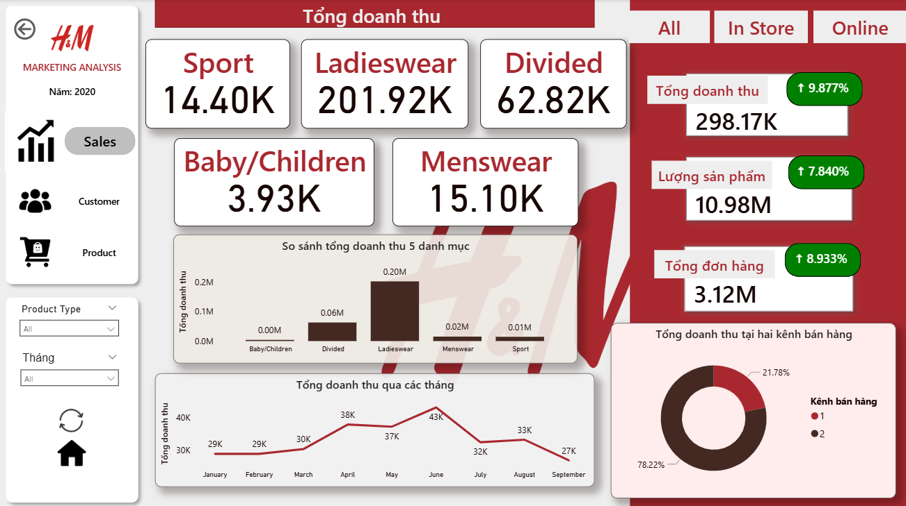
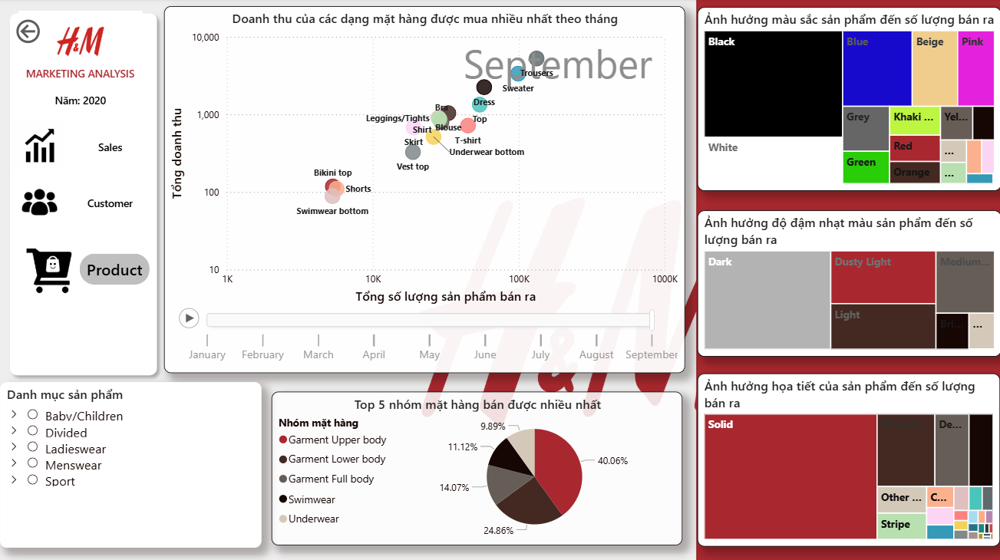
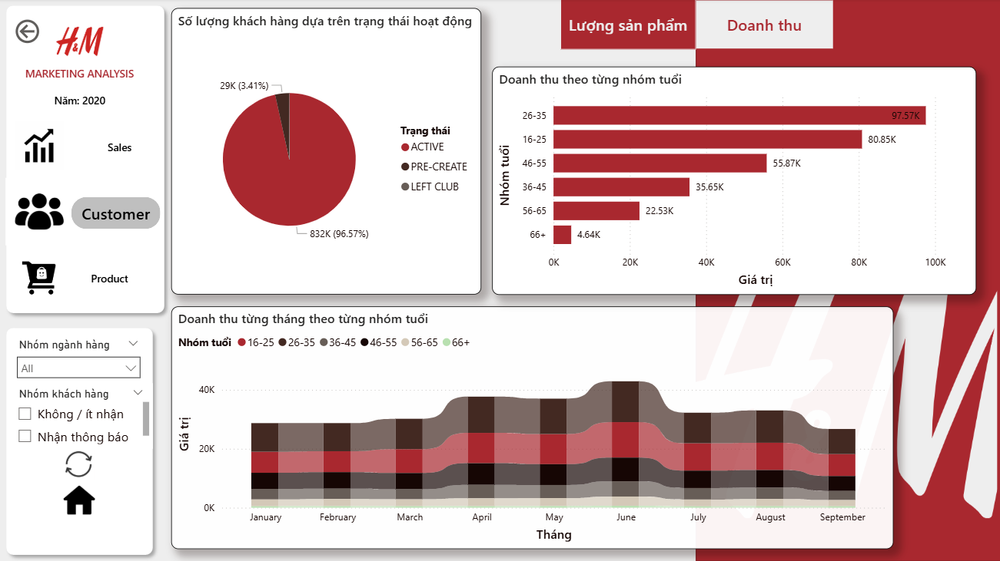

# H&M-Sales-Analytics-Dashboard
Power BI dashboard
# 📊 Power BI Dashboard Project
## 🔗 Link dashboard online
https://tinyurl.com/yptfxmum
## 📌 Overview
This project analyzes business performance through three main aspects: Sales, Product, and Customer.

---
## 📊 Sales Analysis

- Analyze total revenue over time
- Identify peak sales periods
- Compare performance across regions

---
## 📦 Product Analysis

- Identify best-selling products
- Compare product category performance
- Detect low-performing products

---
## 👥 Customer Analysis

- Analyze customer segments
- Identify high-value customers
- Understand customer purchasing behavior
